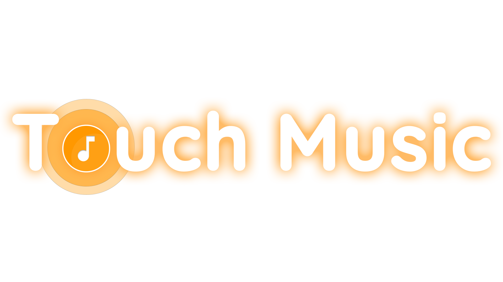

# TouchMusic



> Super Easy Music Finder

2018년 KAIST Creative Team Coding Challenge 우수상

아래는 창코코딩 팀 소개 및 프로젝트 문서입니다.

- [팀 소개](./docs/Team.md)
- [개발 배경 및 필요성](./docs/Motivation.md)
- [개발 목표](./docs/Goal.md)
- [결과물](./docs/Screenshot.md)
- [주요 기능](./docs/Features.md)
- [사용 시나리오](./docs/Scenario.md)
- [기대효과 및 활용분야](./docs/Expansion.md)

## License

```text
Touch Music
Copyright (C) 2018  창조코딩

This program is free software: you can redistribute it and/or modify
it under the terms of the GNU General Public License as published by
the Free Software Foundation, either version 3 of the License, or
(at your option) any later version.

This program is distributed in the hope that it will be useful,
but WITHOUT ANY WARRANTY; without even the implied warranty of
MERCHANTABILITY or FITNESS FOR A PARTICULAR PURPOSE.  See the
GNU General Public License for more details.

You should have received a copy of the GNU General Public License
along with this program.  If not, see <http://www.gnu.org/licenses/>.
```